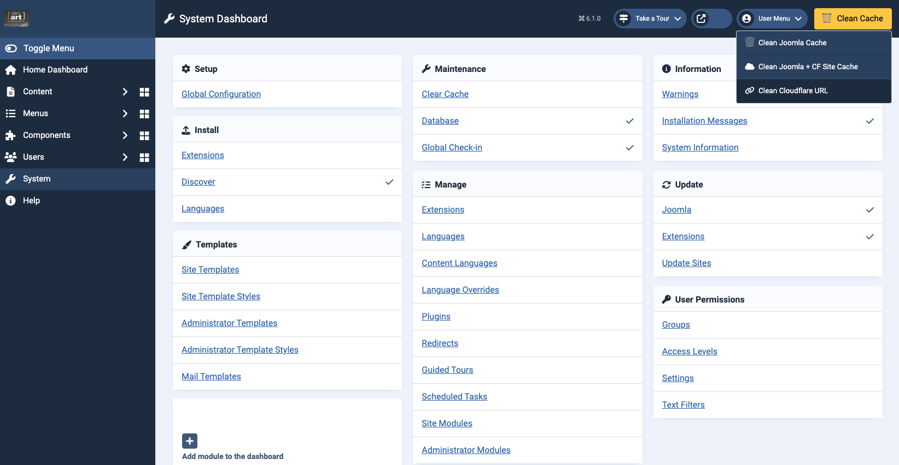
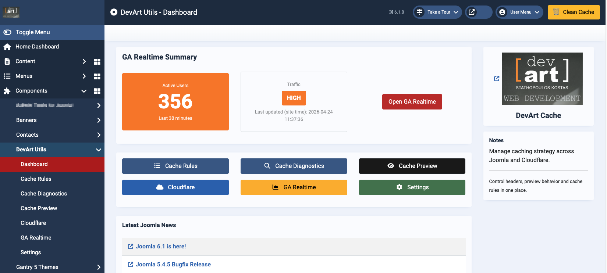
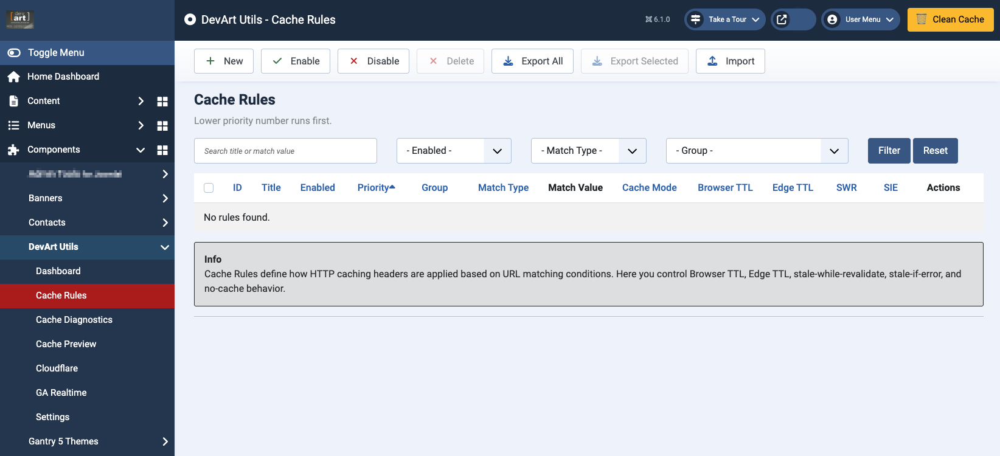
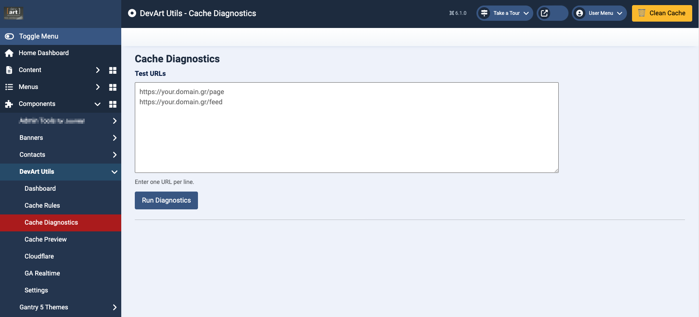
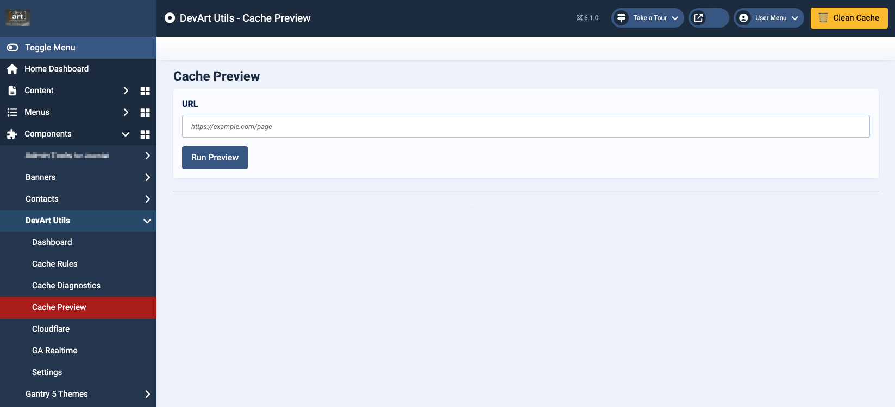
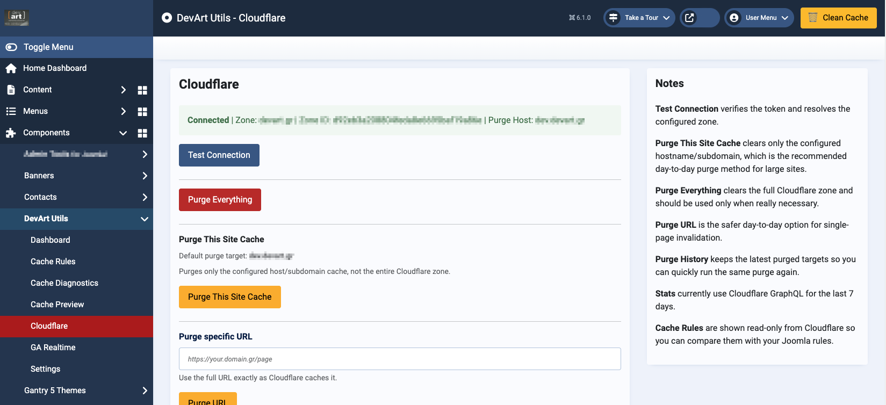
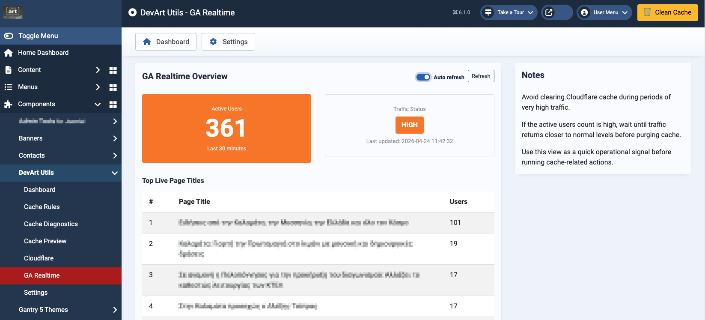

# DevArt Utils for Joomla

Advanced administrator toolkit for Joomla 6 with Cloudflare cache control, GA4 real-time insights, cache diagnostics, and productivity tools.

---

## Features

### Cloudflare Tools
- Purge current site cache
- Purge Joomla + Cloudflare cache
- Purge specific Cloudflare URL
- Secure Connect / Disconnect workflow
- Cloudflare analytics support
- Cloudflare Cache Rules visibility
- Multi-site safe configuration handling

### Google Analytics 4
- Real-time visitor dashboard
- Property integration
- Secure credential storage

### Joomla Tools
- Joomla Page Cache detection
- Cache diagnostics
- Administrator quick actions
- Cache rules support
- Performance utilities

---

## Included Extensions

This package installs:

- `com_devartutils`
- `plg_system_devartcache`
- `plg_system_devartcleancache`

---

## Requirements

- Joomla 6.x
- PHP 8.1+
- Cloudflare account (optional)
- Google Analytics 4 credentials (optional)

---

## Security Highlights

- Encrypted server-side storage for credentials
- CSRF protection
- ACL checks for privileged actions
- Safe API request handling
- Clean uninstall / reinstall support

---

## Screenshots

### Dashboard

### Cache Rules

### Cache Diagnostics

### Cache Preview

### Cloudflare Tools

### GA4 Realtime

### Settings

---

## Installation

1. Download latest release package
2. Open Joomla Administrator
3. Extensions → Install
4. Upload package zip
5. Configure DevArt Utils

---

## Cloudflare Recommended Token Permissions

- Zone: Read
- Cache Purge: Edit
- Zone Analytics: Read (optional)

---

## Google Analytics Setup

Use a Google service account JSON file with access to your GA4 property.

---

## Current Stable Version

**1.2.5**

---

## Changelog 1.2.5

- Fixed Cloudflare Cache Rules panel returning empty results
- Restored correct Cloudflare Cache Rules endpoint compatibility
- Improved Cloudflare diagnostics reliability
- Maintained all previous security hardening improvements

---

## Author

Kostas Stathopoulos  
DevArt

---

## License

GPL v3
