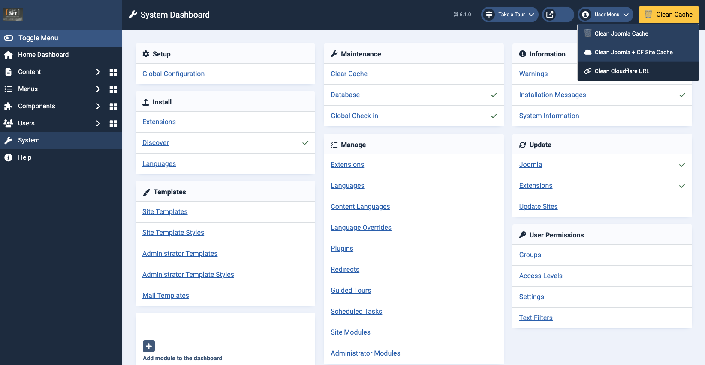
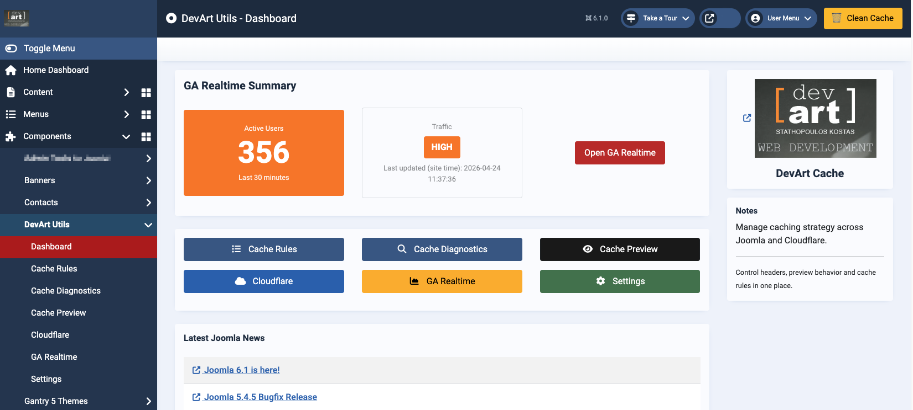
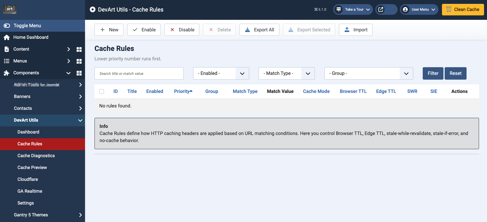
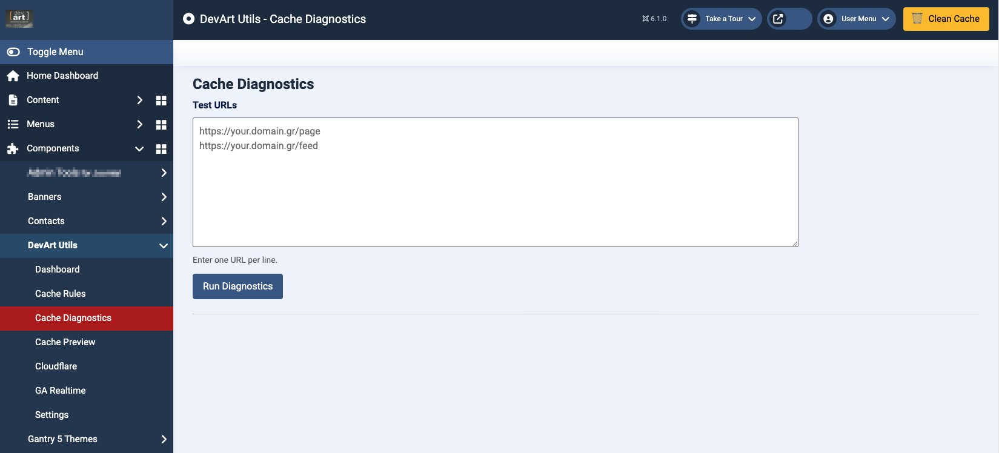
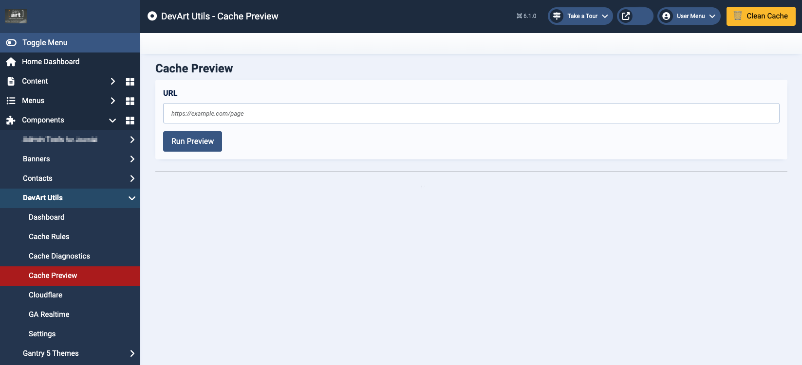
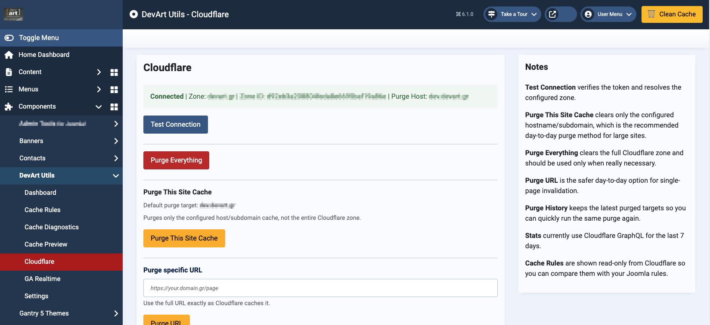
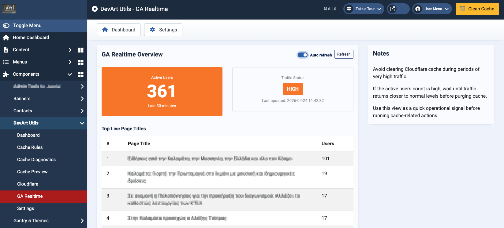

# DevArt Utils for Joomla 6

Advanced administrator suite for Joomla 6 with cache control, Cloudflare integration, Google Analytics 4 dashboards, diagnostics, and built-in administrator tools for high-traffic websites.

---

## Official Documentation

📘 **User Manual (PDF)**  
[Download DevArt Utils Manual](docs/DevArt-Utils-Manual-v1.0.pdf)

---

## Overview

DevArt Utils is the original DevArt Joomla extension. Version **1.3.0** is the current **public** release and the first public update since **1.2.10** (intermediate 1.2.11–1.2.46 builds were internal only).

The installable package (`pkg_devartutils`) is a **suite** that installs every child extension in one step. Joomla native updates target the **package only**.

---

## Version 1.3.0

### Suite & Administrator Tools

- Full DevArt Utils suite in one package install
- **Administrator Tools** hub with diagnostics and root text-file tools
- **Favicon Creator** and **Asset Table Repair** nested under Tools (hidden from the Components menu)
- **15-locale** administrator language packs across the suite
- DevArt admin UX aligned with Article Tools / Slider styling

### Google Analytics 4

- **Realtime**, **7-day**, and **28-day** overview dashboards
- Manual refresh and property-scoped cache
- Top pages, countries, devices, and traffic sources in period views
- Secure credential storage

### Cache & Cloudflare

- Cache admin submenu hub: Rules, Diagnostics, Preview
- Cloudflare admin submenu hub: Clear Cache, Analytics, Rules
- Cloudflare Security Events and Security Center Insights
- Automatic **Vary** headers for multilingual sites and logged-in cache mode
- Deep Joomla cache cleaning and Page Cache detection
- Frontend cache rules via system plugin with invalidation on changes

### Security & Quality

- CSRF hardening for Rules and Settings state-changing actions
- GA Realtime endpoint ACL/CSRF protection
- Encrypted server-side credential storage
- JED pre-release hardening (HttpFactory, filesystem API, GPL headers)
- Safe update from DevArt Utils 1.2.x

---

## Included Extensions

This package installs:

| Extension | Role |
|-----------|------|
| `com_devartutils` | Cache, Cloudflare, GA4, Settings, Tools hub |
| `com_devarttools` | Administrator Tools hub |
| `com_devartfavicon` | Favicon Creator (via Tools) |
| `com_devartassetrepair` | Asset Table Repair (via Tools) |
| `plg_system_devartcache` | Frontend cache header control |
| `plg_system_devartcleancache` | Administrator toolbar cache purge |
| `plg_task_devartassetrepair` | Scheduled Tasks integration |
| `plg_console_devartassetrepair` | Joomla console integration |

Legacy `pkg_devartbackendtools` is superseded by this suite and is no longer maintained separately.

---

## Requirements

- Joomla 6.0+
- PHP 8.3.0+
- Cloudflare account (optional)
- Google Analytics 4 credentials (optional)

---

## Download

Latest release:

`pkg_devartutils_v1.3.0.zip`

GitHub releases:

https://github.com/devartgr/joomla-devart-utils/releases

Direct download:

https://github.com/devartgr/joomla-devart-utils/releases/download/v1.3.0/pkg_devartutils_v1.3.0.zip

SHA-256:

`6300b2549a6ce5e40ca2d03fa9376afa6806d5eb2512e64abed455591ef59fd2`

Update metadata:

https://raw.githubusercontent.com/devartgr/joomla-devart-utils/main/update.xml

Changelog:

https://raw.githubusercontent.com/devartgr/joomla-devart-utils/main/changelog.xml

---

## Installation

1. Download the latest release package
2. Open Joomla Administrator
3. Go to **System → Install → Extensions**
4. Upload `pkg_devartutils_v1.3.0.zip`
5. Open **Components → DevArt Utils**
6. Configure cache, Cloudflare, and GA4 settings as needed
7. Open **Tools** for Administrator Tools, Favicon Creator, and Asset Table Repair

Install the package ZIP once; later updates use Joomla native package updates.

---

## Cloudflare Recommended Token Permissions

- Zone: Read
- Cache Purge: Edit
- Zone Analytics: Read (optional)
- Cache Rules: Read (optional)

### Recommended Cloudflare Administrator Rule

For Joomla administrator areas:

- `/administrator/*`
- Bypass Cache
- Disable Performance

---

## Google Analytics Setup

Use a Google service account JSON file with access to your GA4 property.

Then enter:

- Numeric GA4 Property ID
- Upload JSON credentials file

GA4 Realtime top pages use page/screen titles (`unifiedScreenName`), not URL paths — this is a GA4 Realtime API limitation.

---

## Screenshots

### Dashboard

### Cache Rules

### Cache Diagnostics

### Cache Preview

### Cloudflare Tools

### GA4 Realtime

### Settings

---

## Previous Public Highlights

### 1.2.10

- Visual section headers across administrator pages
- Disclaimer / Limitation of Liability in Settings
- Optimized database index for cache rules matching
- Improved administrator UI consistency and packaging stability

### 1.2.9 — JED Compliance & Licensing

- GPL license declarations in XML manifests and PHP files

### 1.2.8 — GitHub Update System

- Joomla update server feed on GitHub Releases

### 1.2.7 — Deep Cache Fix

- Fully clears Joomla cache including Page Cache / full HTML cache

---

## Security Highlights

- Encrypted server-side storage for Cloudflare and GA credentials
- CSRF protection and ACL checks for privileged actions
- Safe API request handling via Joomla HttpFactory
- Clean uninstall / reinstall support with optional data retention
- GPL-compliant package structure

---

## Disclaimer / Limitation of Liability

This software is provided "as is", without warranty of any kind.

DevArt shall not be held liable for any damages, data loss, downtime, security issues, or other problems resulting from the use or misuse of this software.

Users are responsible for testing the software in their own environment and maintaining proper backups before installation or upgrades.

Always test on a staging environment before using in production.

---

## Author

**Kostas Stathopoulos**  
DevArt — https://devart.gr

---

## License

GNU General Public License v3 or later
